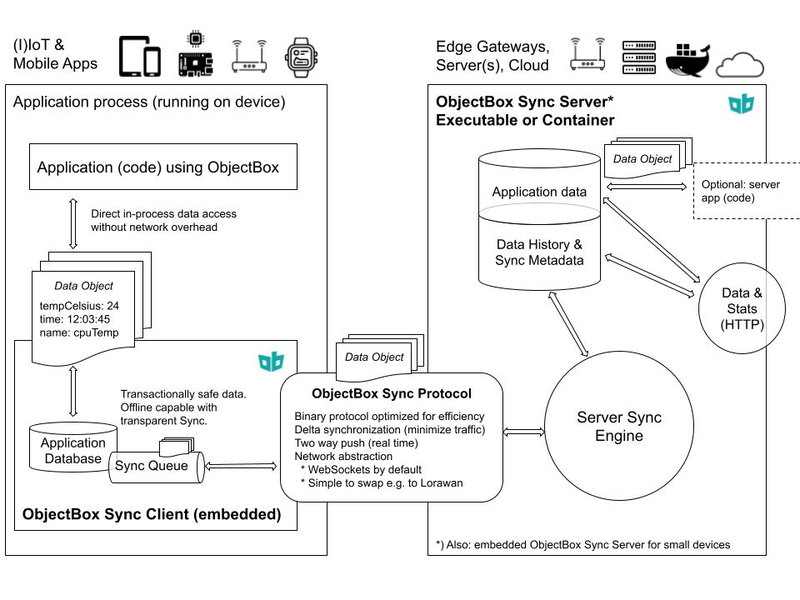

# ObjectBox Sync

[Website][1] | [Developer documentation][2] | [Examples](#sync-examples)

[ObjectBox Sync][1] offers a comprehensive, out-of-the-box solution designed to efficiently manage
and harmonize data flows between devices, irrespective of network connectivity. By facilitating
bi-directional, selective data synchronization, ObjectBox Sync eliminates the complexities
associated with offline-first architectures and cross-platform data management.



Learn more on the [Sync website][1] and [developer documentation][2].

## Sync Examples

The following examples demonstrating Sync capabilities are available in this repository:

1. [Task Manager App](/tasks)

[1]: https://objectbox.io/sync/
[2]: https://sync.objectbox.io/

## License

```text
Copyright 2025 ObjectBox Ltd. All rights reserved.

Licensed under the Apache License, Version 2.0 (the "License");
you may not use this file except in compliance with the License.
You may obtain a copy of the License at

    https://www.apache.org/licenses/LICENSE-2.0

Unless required by applicable law or agreed to in writing, software
distributed under the License is distributed on an "AS IS" BASIS,
WITHOUT WARRANTIES OR CONDITIONS OF ANY KIND, either express or implied.
See the License for the specific language governing permissions and
limitations under the License.
```

Note that this license applies to the code in this repository only.
See our website on details about all [licenses for ObjectBox components](https://objectbox.io/faq/#license-pricing).
