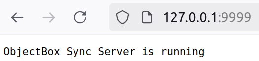
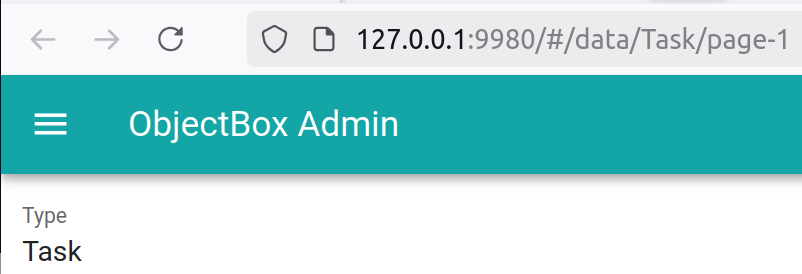

# Sync Server Tasks Example

Starting the ObjectBox Sync Server involves only running a single script.
Additionally, we will show how to verify the setup and how to access the Admin interface.

## Prerequisites

To start the ObjectBox Sync Server, you need its Docker image.
Basic setup instructions are available on the page [sync-server.md](../../sync-server.md)
at the top directory level of this sync examples project.

## Start the Sync Server

You can start the Sync Server using the provided scripts in this directory.
Both scripts take the Sync Server version as an argument, which must be adjusted to the version you have.

**Linux/macOS:** run [start.sh](start.sh):

```bash
# Replace with the date-based version with version you got from ObjectBox
./start.sh 2025-03-10
```

**Windows:** run [start.bat](start.bat):

```batch
REM Replace with the date-based version with version you got from ObjectBox
start.bat 2025-02-03
```

The scripts will:

- Mount the current directory as `/data` in the container
    - Note: `/data` is also the working directory inside the container
    - Makes the configuration `sync-server-config.json` available to the Sync Server
    - Shares the database directory `objectbox`, which is created inside the container
- Publish port 9999 for the Sync protocol on the host machine
- Publish port 9980 for the Admin interface on the host machine

### Sync Server logs

When the Sync Server starts, it writes its logs to the console.
A successful start looks similar to this with "..." indicating omitted lines:

```text
001-16:31:07.4704 [INFO ] [SvSyAp] Starting ObjectBox Sync Server version 5 (protocol version: 6, core: 4.2.0-2025-03-10 (SyncServer, http, graphql, admin, tree, dlog, cluster, backup, lmdb, SyncMongoDb, Auth))
001-16:31:07.4707 [INFO ] [SvSyAp] Loading configuration file sync-server-config.json
...
001-16:31:07.4849 [INFO ] [SvSyAp] Model file /data/objectbox-model.json loaded, it has 1354 bytes
...
001-16:31:07.5505 [INFO ] [SvSyRs] Starting admin server on http://0.0.0.0:9980
...
001-16:31:07.5505 [WARN ] [SvHttp] UNSECURED no-authentication mode enabled:
...
001-16:31:07.5507 [INFO ] [SvSyAp] ObjectBox sync server started in 80 ms
```

### Verify the Sync Server

Once the Sync Server is up and running, you can verify that its Sync port (9999) is available.
Enter http://127.0.0.1:9999/ in a browser and the result should look like this:



### Congratulations!

You have successfully started the ObjectBox Sync Server for the "Tasks" example. 🎉

Now, let the clients connect...

## Access the Admin Interface

The Sync Server Admin interface is available at http://127.0.0.1:9980/ in a browser:



The Admin allows you to browse data and various information on Sync itself (e.g. statistics and history).
Also, on the "Status" page, it allows you to enable debug logging,
which may be helpful in case you run into problems.
By default, the ObjectBox Sync Server logs only some important information after startup.

For more information,
please refer to the [Sync Server Configuration](https://sync.objectbox.io/sync-server-configuration) documentation,
which has a [paragraph on the Admin Web UI](https://sync.objectbox.io/objectbox-sync-server#admin-web-ui).

## Documentation Links

Use the following links to learn more about ObjectBox Sync Server:

- [Get a Sync trial](https://objectbox.io/sync/)
- [Sync Server](https://sync.objectbox.io/objectbox-sync-server)
- [Sync Server Configuration](https://sync.objectbox.io/sync-server-configuration)
